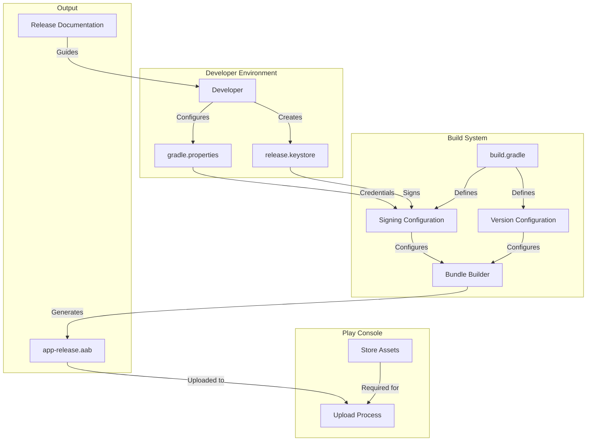
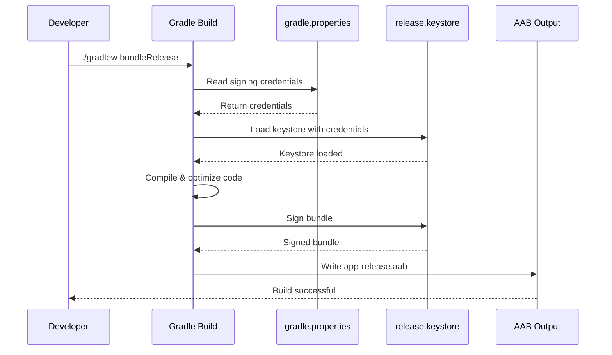

# Design Document: Android Release Configuration

## Overview

This design establishes a secure, production-ready Android release configuration for a React Native application. The system transforms the current debug-keystore-based release process into a proper production pipeline suitable for Google Play Console uploads.

The design focuses on three core areas:
1. **Keystore and Signing Infrastructure** - Secure credential management and signing configuration
2. **Build System Configuration** - Gradle-based automation for release builds
3. **Release Process Documentation** - Comprehensive guides for executing releases

The implementation leverages Gradle's native signing capabilities, follows Android security best practices, and provides clear documentation for team members to execute releases confidently.

## Architecture

### High-Level Architecture



### Component Interaction Flow



## Components and Interfaces

### 1. Keystore Management Component

**Purpose:** Generate and manage the production keystore file.

**Implementation:**
- Use Java `keytool` command-line utility (included with JDK)
- Generate PKCS12 format keystore (modern standard, replaces JKS)
- Store keystore file outside project directory (e.g., `~/.android/keystores/`)

**Key Generation Command:**
```bash
keytool -genkeypair -v \
  -storetype PKCS12 \
  -keystore ~/.android/keystores/release.keystore \
  -alias my-app-key \
  -keyalg RSA \
  -keysize 2048 \
  -validity 10000 \
  -storepass <STORE_PASSWORD> \
  -keypass <KEY_PASSWORD> \
  -dname "CN=Your Name, OU=Your Organization, O=Your Company, L=City, ST=State, C=Country"
```

**Parameters:**
- `storetype PKCS12`: Modern keystore format
- `keysize 2048`: Minimum recommended key size
- `validity 10000`: ~27 years (exceeds Google's 25-year requirement)
- `alias`: Identifier for the key within the keystore

**Security Considerations:**
- Store keystore file in user home directory, not in project
- Create encrypted backup of keystore file
- Document keystore location and credentials in secure password manager
- Never commit keystore file to version control

### 2. Credential Storage Component

**Purpose:** Securely store and provide access to signing credentials.

**Implementation:**
- Use `gradle.properties` file in project root
- Add `gradle.properties` to `.gitignore`
- Provide `gradle.properties.example` template

**gradle.properties Structure:**
```properties
# Release signing configuration
RELEASE_STORE_FILE=/Users/username/.android/keystores/release.keystore
RELEASE_STORE_PASSWORD=your_store_password
RELEASE_KEY_ALIAS=my-app-key
RELEASE_KEY_PASSWORD=your_key_password
```

**gradle.properties.example Structure:**
```properties
# Release signing configuration
# Copy this file to gradle.properties and fill in your actual values
RELEASE_STORE_FILE=/path/to/your/release.keystore
RELEASE_STORE_PASSWORD=your_store_password_here
RELEASE_KEY_ALIAS=your_key_alias_here
RELEASE_KEY_PASSWORD=your_key_password_here
```

**.gitignore Entry:**
```
# Gradle properties (contains signing credentials)
gradle.properties
```

### 3. Signing Configuration Component

**Purpose:** Configure Gradle to sign release builds with production keystore.

**Implementation Location:** `android/app/build.gradle`

**Configuration Structure:**
```groovy
android {
    ...
    
    signingConfigs {
        debug {
            // Default debug signing (unchanged)
            storeFile file('debug.keystore')
            storePassword 'android'
            keyAlias 'androiddebugkey'
            keyPassword 'android'
        }
        
        release {
            // Production signing configuration
            if (project.hasProperty('RELEASE_STORE_FILE')) {
                storeFile file(RELEASE_STORE_FILE)
                storePassword RELEASE_STORE_PASSWORD
                keyAlias RELEASE_KEY_ALIAS
                keyPassword RELEASE_KEY_PASSWORD
            } else {
                throw new GradleException(
                    "Release signing not configured. " +
                    "Copy gradle.properties.example to gradle.properties " +
                    "and fill in your keystore details."
                )
            }
        }
    }
    
    buildTypes {
        debug {
            signingConfig signingConfigs.debug
        }
        
        release {
            signingConfig signingConfigs.release
            minifyEnabled true
            shrinkResources true
            proguardFiles getDefaultProguardFile('proguard-android-optimize.txt'), 'proguard-rules.pro'
        }
    }
}
```

**Key Features:**
- Conditional configuration check (fails fast if credentials missing)
- Separate debug and release signing configs
- Clear error message for missing configuration
- Enables code shrinking and obfuscation for release builds

### 4. Version Management Component

**Purpose:** Manage version codes and version names for Play Console uploads.

**Implementation Location:** `android/app/build.gradle`

**Configuration Structure:**
```groovy
android {
    defaultConfig {
        applicationId "com.yourapp.id"
        minSdkVersion rootProject.ext.minSdkVersion
        targetSdkVersion rootProject.ext.targetSdkVersion
        versionCode 1
        versionName "1.0.0"
    }
}
```

**Versioning Strategy:**
- **versionCode**: Integer that MUST increment with each Play Console upload
  - Start at 1
  - Increment by 1 for each release (1, 2, 3, ...)
  - Never reuse or decrement
  - Used by Play Console to determine which version is newer
  
- **versionName**: User-facing version string
  - Follow semantic versioning: MAJOR.MINOR.PATCH
  - Example progression: "1.0.0" → "1.0.1" → "1.1.0" → "2.0.0"
  - MAJOR: Breaking changes
  - MINOR: New features (backward compatible)
  - PATCH: Bug fixes

**Version Increment Rules:**
1. Before each Play Console upload, increment versionCode
2. Update versionName based on changes:
   - Bug fixes only: increment PATCH (1.0.0 → 1.0.1)
   - New features: increment MINOR (1.0.1 → 1.1.0)
   - Breaking changes: increment MAJOR (1.1.0 → 2.0.0)

### 5. Bundle Builder Component

**Purpose:** Generate signed Android App Bundle (AAB) files for Play Console.

**Implementation:**
- Use Gradle's `bundleRelease` task
- Output location: `android/app/build/outputs/bundle/release/app-release.aab`

**Build Command:**
```bash
cd android
./gradlew bundleRelease
```

**Build Process:**
1. Compile React Native JavaScript bundle
2. Compile native Android code
3. Apply ProGuard/R8 code shrinking and obfuscation
4. Package resources and code into AAB format
5. Sign AAB with release keystore
6. Output signed AAB file

**Verification:**
After building, verify the AAB:
```bash
# Check AAB file exists and size
ls -lh android/app/build/outputs/bundle/release/app-release.aab

# Verify signing (requires bundletool)
bundletool validate --bundle=android/app/build/outputs/bundle/release/app-release.aab
```

### 6. Play Console Preparation Component

**Purpose:** Prepare all required assets and information for Play Console upload.

**Required Assets:**

1. **Privacy Policy**
   - Location: `docs/PrivacyPolicy.md` (already exists)
   - Must be hosted at publicly accessible URL
   - Required before publishing app

2. **App Icon**
   - Format: 512x512 PNG
   - 32-bit PNG with alpha channel
   - Full bleed (no rounded corners, Play Console adds them)

3. **Screenshots**
   - Minimum: 2 screenshots
   - Recommended: 4-8 screenshots
   - Phone: 16:9 or 9:16 aspect ratio
   - Minimum dimension: 320px
   - Maximum dimension: 3840px

4. **Feature Graphic**
   - Size: 1024x500 PNG or JPEG
   - Used in Play Store promotions

5. **Store Listing Content**
   - App name (max 50 characters)
   - Short description (max 80 characters)
   - Full description (max 4000 characters)
   - Category selection
   - Contact email
   - Privacy policy URL

6. **Content Rating**
   - Complete IARC questionnaire in Play Console
   - Answer questions about app content
   - Receive rating for all regions

7. **Target Audience**
   - Select target age groups
   - Indicate if app is designed for children

**Upload Checklist:**
```markdown
- [ ] AAB file built and signed
- [ ] versionCode incremented
- [ ] versionName updated
- [ ] Privacy policy URL ready
- [ ] App icon (512x512) prepared
- [ ] Screenshots (minimum 2) prepared
- [ ] Feature graphic (1024x500) prepared
- [ ] Store listing content written
- [ ] Content rating questionnaire completed
- [ ] Target audience configured
```

## Data Models

### Keystore Metadata

```typescript
interface KeystoreMetadata {
  filePath: string;           // Absolute path to keystore file
  alias: string;              // Key alias within keystore
  storePassword: string;      // Keystore password (stored in gradle.properties)
  keyPassword: string;        // Key password (stored in gradle.properties)
  format: 'PKCS12';          // Keystore format
  keyAlgorithm: 'RSA';       // Key algorithm
  keySize: 2048;             // Key size in bits
  validityDays: number;      // Validity period in days
  createdDate: Date;         // Creation date
}
```

### Version Configuration

```typescript
interface VersionConfig {
  versionCode: number;        // Integer version code (must increment)
  versionName: string;        // Semantic version string (e.g., "1.0.0")
  previousVersionCode?: number;  // Previous version code (for tracking)
  previousVersionName?: string;  // Previous version name (for tracking)
}
```

### Signing Configuration

```typescript
interface SigningConfig {
  name: 'debug' | 'release';
  storeFile: string;          // Path to keystore file
  storePassword: string;      // Keystore password
  keyAlias: string;           // Key alias
  keyPassword: string;        // Key password
}
```

### Build Output

```typescript
interface BuildOutput {
  format: 'AAB' | 'APK';
  filePath: string;           // Path to output file
  fileSize: number;           // File size in bytes
  versionCode: number;        // Version code in build
  versionName: string;        // Version name in build
  signed: boolean;            // Whether file is signed
  signingConfig: 'debug' | 'release';  // Which signing config was used
  buildTimestamp: Date;       // When build was created
}
```

### Play Console Asset

```typescript
interface PlayConsoleAsset {
  type: 'icon' | 'screenshot' | 'feature-graphic';
  filePath: string;           // Path to asset file
  dimensions: {
    width: number;
    height: number;
  };
  format: 'PNG' | 'JPEG';
  fileSize: number;           // File size in bytes
  validated: boolean;         // Whether asset meets requirements
}
```

## Correctness Properties

*A property is a characteristic or behavior that should hold true across all valid executions of a system—essentially, a formal statement about what the system should do. Properties serve as the bridge between human-readable specifications and machine-verifiable correctness guarantees.*


### Property 1: Keystore Generation Compliance
*For any* generated keystore file, it should be in PKCS12 format, have a key size of at least 2048 bits, have a validity period of at least 25 years (9125 days), and be stored outside the project repository directory.

**Validates: Requirements 1.1, 1.2, 1.3, 1.4, 7.1**

### Property 2: Release Builds Use Production Keystore
*For any* release build (AAB or APK), the output should be signed with the production keystore specified in gradle.properties, not the debug keystore.

**Validates: Requirements 3.1**

### Property 3: Debug Builds Use Debug Keystore
*For any* debug build (AAB or APK), the output should be signed with the debug keystore, ensuring backward compatibility with existing debug workflows.

**Validates: Requirements 3.2, 10.5**

### Property 4: Credential Source Consistency
*For any* build that accesses signing credentials, the credentials should be read from gradle.properties file using the project.property() API.

**Validates: Requirements 2.4, 10.3**

### Property 5: Version Configuration Validity
*For any* build configuration, the versionCode should be a positive integer and the versionName should follow semantic versioning format (MAJOR.MINOR.PATCH), and both should be present in the generated manifest.

**Validates: Requirements 4.1, 4.2, 4.3, 9.4, 9.5**

### Property 6: Release Bundle Generation
*For any* successful release build command execution, an AAB file should be generated at the expected output location (android/app/build/outputs/bundle/release/app-release.aab).

**Validates: Requirements 5.1, 5.3**

### Property 7: Release Bundle Signing
*For any* generated AAB file from a release build, it should be signed with the production keystore and the signature should be verifiable.

**Validates: Requirements 5.2, 3.3**

### Property 8: Code Optimization Enabled
*For any* release build, code shrinking and obfuscation (ProGuard/R8) should be enabled in the build configuration, resulting in optimized output.

**Validates: Requirements 5.4**

### Property 9: Bundle Integrity Validation
*For any* generated AAB file, it should pass bundletool validation checks, confirming the bundle structure and signing are correct.

**Validates: Requirements 5.5**

### Property 10: Required Signing Properties Validation
*For any* release build attempt, if any required signing property (RELEASE_STORE_FILE, RELEASE_STORE_PASSWORD, RELEASE_KEY_ALIAS, RELEASE_KEY_PASSWORD) is missing, the build should fail before compilation with a descriptive error message.

**Validates: Requirements 3.5**

## Error Handling

### Keystore Generation Errors

**Missing JDK/keytool:**
- **Detection:** Command not found error when running keytool
- **Handling:** Provide clear error message with JDK installation instructions
- **Recovery:** Install JDK and retry

**Invalid Keystore Parameters:**
- **Detection:** keytool returns error for invalid parameters
- **Handling:** Validate parameters before execution, provide corrected command
- **Recovery:** Fix parameters and regenerate keystore

**Keystore File Already Exists:**
- **Detection:** File exists at target path
- **Handling:** Warn user, require explicit confirmation to overwrite
- **Recovery:** Choose different path or backup existing keystore

### Credential Configuration Errors

**Missing gradle.properties:**
- **Detection:** File not found when Gradle reads properties
- **Handling:** Throw GradleException with setup instructions
- **Error Message:** "Release signing not configured. Copy gradle.properties.example to gradle.properties and fill in your keystore details."
- **Recovery:** Create gradle.properties from template

**Missing Signing Properties:**
- **Detection:** project.hasProperty() returns false
- **Handling:** Fail build immediately with list of missing properties
- **Error Message:** "Missing required signing properties: [list]. Check gradle.properties file."
- **Recovery:** Add missing properties to gradle.properties

**Invalid Keystore Path:**
- **Detection:** File not found at RELEASE_STORE_FILE path
- **Handling:** Fail build with file path in error message
- **Error Message:** "Keystore file not found at: [path]. Verify RELEASE_STORE_FILE in gradle.properties."
- **Recovery:** Correct path in gradle.properties or move keystore to expected location

**Incorrect Keystore Password:**
- **Detection:** Keystore authentication failure during signing
- **Handling:** Fail build with authentication error
- **Error Message:** "Failed to load keystore. Verify RELEASE_STORE_PASSWORD and RELEASE_KEY_PASSWORD in gradle.properties."
- **Recovery:** Correct passwords in gradle.properties

### Build Errors

**Compilation Failures:**
- **Detection:** Gradle compilation task fails
- **Handling:** Display compilation errors from Gradle
- **Recovery:** Fix code errors and rebuild

**Signing Failures:**
- **Detection:** Signing task fails during build
- **Handling:** Display signing error with keystore details
- **Recovery:** Verify keystore configuration and credentials

**Bundle Generation Failures:**
- **Detection:** bundleRelease task fails
- **Handling:** Display Gradle error output
- **Recovery:** Check build configuration and dependencies

### Version Management Errors

**Invalid versionCode:**
- **Detection:** Non-integer or negative versionCode
- **Handling:** Fail build with validation error
- **Error Message:** "versionCode must be a positive integer. Current value: [value]"
- **Recovery:** Set valid versionCode in build.gradle

**Invalid versionName:**
- **Detection:** versionName doesn't match semantic versioning pattern
- **Handling:** Warn during build (non-fatal)
- **Warning Message:** "versionName should follow semantic versioning (MAJOR.MINOR.PATCH). Current value: [value]"
- **Recovery:** Update versionName to follow convention

**Duplicate versionCode:**
- **Detection:** Play Console rejects upload
- **Handling:** Play Console error message
- **Recovery:** Increment versionCode and rebuild

### Play Console Upload Errors

**Missing Required Assets:**
- **Detection:** Play Console validation fails
- **Handling:** Display list of missing assets
- **Recovery:** Prepare missing assets and retry upload

**Privacy Policy URL Not Accessible:**
- **Detection:** Play Console cannot access privacy policy URL
- **Handling:** Display URL validation error
- **Recovery:** Verify URL is publicly accessible and retry

**Content Rating Incomplete:**
- **Detection:** Play Console blocks upload
- **Handling:** Redirect to content rating questionnaire
- **Recovery:** Complete questionnaire and retry upload

## Testing Strategy

This feature requires a dual testing approach combining configuration validation tests with integration tests for the build pipeline.

### Unit Tests

Unit tests focus on specific configuration validation and error handling:

1. **Configuration File Tests**
   - Verify gradle.properties.example has correct structure
   - Verify .gitignore contains gradle.properties entry
   - Verify build.gradle has correct signing config structure

2. **Validation Logic Tests**
   - Test versionCode validation (positive integer check)
   - Test versionName validation (semantic versioning format)
   - Test signing property presence validation

3. **Error Message Tests**
   - Test error message for missing gradle.properties
   - Test error message for missing signing properties
   - Test error message for invalid keystore path

4. **Edge Cases**
   - Empty gradle.properties file
   - Malformed gradle.properties (invalid syntax)
   - Missing keystore file
   - Incorrect keystore password
   - Non-existent keystore path

### Property-Based Tests

Property-based tests verify universal properties across the build system. Each test should run a minimum of 100 iterations with randomized inputs.

**Testing Framework:** Use a property-based testing library appropriate for Gradle/Groovy testing:
- **Option 1:** Spock Framework with data-driven testing
- **Option 2:** JUnit 5 with jqwik for property-based testing
- **Option 3:** Custom Gradle test tasks with randomized inputs

**Property Test Implementation:**

Each correctness property must be implemented as a property-based test with the following tag format in comments:
```
// Feature: android-release-configuration, Property N: [property text]
```

**Property Test 1: Keystore Generation Compliance**
- Generate keystores with randomized parameters (within valid ranges)
- Verify PKCS12 format using keytool inspection
- Verify key size >= 2048 bits
- Verify validity >= 9125 days
- Verify file path is outside project directory
- **Tag:** `// Feature: android-release-configuration, Property 1: Keystore Generation Compliance`

**Property Test 2: Release Builds Use Production Keystore**
- Build release AAB/APK with various configurations
- Extract signing certificate from output
- Verify certificate matches production keystore
- Verify certificate does NOT match debug keystore
- **Tag:** `// Feature: android-release-configuration, Property 2: Release Builds Use Production Keystore`

**Property Test 3: Debug Builds Use Debug Keystore**
- Build debug APK with various configurations
- Extract signing certificate from output
- Verify certificate matches debug keystore
- **Tag:** `// Feature: android-release-configuration, Property 3: Debug Builds Use Debug Keystore`

**Property Test 4: Credential Source Consistency**
- Generate random credential values in gradle.properties
- Trigger build and capture credential access
- Verify credentials read match gradle.properties values
- **Tag:** `// Feature: android-release-configuration, Property 4: Credential Source Consistency`

**Property Test 5: Version Configuration Validity**
- Generate random valid versionCodes (positive integers)
- Generate random valid versionNames (semantic versioning)
- Build with these versions
- Extract version from generated manifest
- Verify versions match configuration
- **Tag:** `// Feature: android-release-configuration, Property 5: Version Configuration Validity`

**Property Test 6: Release Bundle Generation**
- Execute release build command
- Verify AAB file exists at expected path
- Verify file is non-empty
- **Tag:** `// Feature: android-release-configuration, Property 6: Release Bundle Generation`

**Property Test 7: Release Bundle Signing**
- Generate release AAB
- Extract signing certificate
- Verify signature is valid
- Verify signature matches production keystore
- **Tag:** `// Feature: android-release-configuration, Property 7: Release Bundle Signing`

**Property Test 8: Code Optimization Enabled**
- Build release AAB
- Verify ProGuard/R8 was executed (check build logs)
- Verify AAB size is smaller than debug build
- **Tag:** `// Feature: android-release-configuration, Property 8: Code Optimization Enabled`

**Property Test 9: Bundle Integrity Validation**
- Generate release AAB
- Run bundletool validate command
- Verify validation passes with no errors
- **Tag:** `// Feature: android-release-configuration, Property 9: Bundle Integrity Validation`

**Property Test 10: Required Signing Properties Validation**
- Generate configurations with randomly missing properties
- Attempt release build
- Verify build fails before compilation
- Verify error message lists missing properties
- **Tag:** `// Feature: android-release-configuration, Property 10: Required Signing Properties Validation`

### Integration Tests

Integration tests verify the complete build pipeline:

1. **End-to-End Release Build**
   - Set up complete signing configuration
   - Execute full release build
   - Verify AAB is generated and signed
   - Verify AAB passes bundletool validation

2. **Keystore Generation to Build**
   - Generate new keystore
   - Configure gradle.properties
   - Execute release build
   - Verify successful signed output

3. **Version Increment Workflow**
   - Build with versionCode N
   - Increment to versionCode N+1
   - Build again
   - Verify new version in output

4. **Multi-Environment Setup**
   - Test setup on fresh environment
   - Verify gradle.properties.example works as template
   - Verify error messages guide setup correctly

### Manual Testing Checklist

Some aspects require manual verification:

- [ ] Keystore backup and recovery procedures
- [ ] Play Console upload with generated AAB
- [ ] Privacy policy URL accessibility
- [ ] Store listing asset quality (icons, screenshots)
- [ ] Content rating questionnaire completion
- [ ] App functionality after ProGuard/R8 optimization

### Test Configuration

**Minimum Iterations:** 100 per property test (due to randomization)

**Test Environment Requirements:**
- JDK 11 or higher (for keytool)
- Android SDK with build tools
- Gradle 7.0 or higher
- bundletool (for AAB validation)

**Test Data:**
- Sample keystores for testing
- Mock gradle.properties configurations
- Test version numbers
- Sample app code for building

### Continuous Integration

Integrate tests into CI pipeline:

1. **Pre-commit Hooks**
   - Verify .gitignore contains gradle.properties
   - Verify no keystore files in commit

2. **CI Build Pipeline**
   - Run unit tests
   - Run property-based tests
   - Run integration tests (with test keystore)
   - Verify debug builds still work

3. **Release Pipeline**
   - Verify versionCode incremented
   - Build release AAB
   - Run bundletool validation
   - Archive signed AAB as artifact
