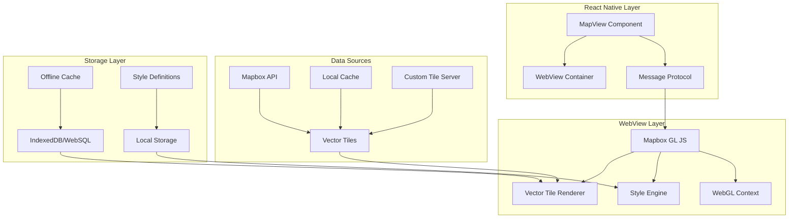

# Mapbox Vector Tiles Integration Design

## Overview

This design document outlines the integration of Mapbox vector tiles into the RollTracks React Native application, replacing the current Leaflet-based raster tile system. The solution maintains the existing WebView architecture while upgrading to Mapbox GL JS for improved performance, visual quality, and dynamic styling capabilities.

The integration preserves all existing functionality including real-time location tracking, route visualization, obstacle markers, and offline capabilities while providing a foundation for enhanced accessibility features and customizable map styling.

## Architecture

### High-Level Architecture



### Component Integration

The new vector tile system integrates with existing components:

- **MapView Component**: Enhanced to support Mapbox GL JS initialization and configuration
- **Message Protocol**: Extended to handle vector-specific operations like style updates
- **Location Services**: Unchanged, continues to provide GPS coordinates
- **Route Visualization**: Upgraded to use Mapbox GL JS vector layers
- **Obstacle Markers**: Migrated to Mapbox GL JS markers and popups

## Components and Interfaces

### MapView Component Interface

```typescript
interface MapViewProps {
  // Existing props maintained for compatibility
  currentLocation: LocationPoint | null;
  routePoints: LocationPoint[];
  obstacleFeatures?: ObstacleFeature[];
  showCompleteRoute?: boolean;
  onMapReady?: () => void;
  onMapError?: (error: string) => void;
  onFeatureTap?: (feature: ObstacleFeature) => void;
  ratedFeatureIds?: string[];
  ratedFeatureRatings?: Record<string, number>;
  
  // New vector tile specific props
  mapStyle?: MapboxStyle | string;
  tileSource?: TileSourceConfig;
  offlineRegions?: OfflineRegion[];
  accessibilityMode?: boolean;
  customStyleOverrides?: StyleOverride[];
}

interface TileSourceConfig {
  type: 'mapbox' | 'custom' | 'local';
  apiKey?: string;
  baseUrl?: string;
  styleUrl?: string;
  fallbackSources?: TileSourceConfig[];
}

interface MapboxStyle {
  version: number;
  sources: Record<string, any>;
  layers: any[];
  glyphs?: string;
  sprite?: string;
}
```

### Message Protocol Extensions

```typescript
type MapMessage = 
  // Existing messages maintained
  | { type: 'updateLocation'; payload: LocationPoint }
  | { type: 'addRoutePoint'; payload: LocationPoint }
  | { type: 'setRoute'; payload: LocationPoint[] }
  | { type: 'clearRoute' }
  | { type: 'updateObstacles'; payload: ObstacleFeature[] }
  | { type: 'updateRatedFeatures'; payload: { ids: string[]; ratings: Record<string, number> } }
  
  // New vector tile messages
  | { type: 'updateStyle'; payload: MapboxStyle }
  | { type: 'setTileSource'; payload: TileSourceConfig }
  | { type: 'enableAccessibilityMode'; payload: boolean }
  | { type: 'downloadOfflineRegion'; payload: OfflineRegion }
  | { type: 'clearOfflineCache' }
  | { type: 'setStyleOverrides'; payload: StyleOverride[] };

type WebViewMessage =
  // Existing messages maintained
  | { type: 'mapReady' }
  | { type: 'mapError'; payload: string }
  | { type: 'featureTapped'; payload: ObstacleFeature }
  
  // New vector tile messages
  | { type: 'styleLoaded' }
  | { type: 'tileSourceChanged'; payload: string }
  | { type: 'offlineDownloadProgress'; payload: { region: string; progress: number } }
  | { type: 'offlineDownloadComplete'; payload: { region: string; tileCount: number } }
  | { type: 'webglNotSupported' }
  | { type: 'fallbackActivated'; payload: string };
```

### Tile Source Manager

```typescript
interface TileSourceManager {
  initialize(config: TileSourceConfig): Promise<void>;
  switchSource(newConfig: TileSourceConfig): Promise<void>;
  validateSource(config: TileSourceConfig): Promise<boolean>;
  getAvailableSources(): TileSourceConfig[];
  handleSourceError(error: Error, source: TileSourceConfig): Promise<TileSourceConfig | null>;
}
```

### Offline Cache Manager

```typescript
interface OfflineCacheManager {
  downloadRegion(region: OfflineRegion, onProgress?: (progress: number) => void): Promise<void>;
  getCachedRegions(): Promise<OfflineRegion[]>;
  deleteCachedRegion(regionId: string): Promise<void>;
  getCacheSize(): Promise<number>;
  clearCache(): Promise<void>;
  isRegionCached(bounds: BoundingBox, minZoom: number, maxZoom: number): Promise<boolean>;
}
```

## Data Models

### Vector Tile Configuration

```typescript
interface OfflineRegion {
  id: string;
  name: string;
  bounds: BoundingBox;
  minZoom: number;
  maxZoom: number;
  styleUrl: string;
  downloadDate?: Date;
  tileCount?: number;
  sizeBytes?: number;
}

interface BoundingBox {
  north: number;
  south: number;
  east: number;
  west: number;
}

interface StyleOverride {
  layerId: string;
  property: string;
  value: any;
  condition?: string;
}
```

### Accessibility Configuration

```typescript
interface AccessibilityMapConfig {
  highContrast: boolean;
  largeText: boolean;
  simplifiedColors: boolean;
  enhancedObstacleMarkers: boolean;
  customColorScheme?: {
    background: string;
    roads: string;
    buildings: string;
    text: string;
    obstacles: {
      good: string;
      fair: string;
      poor: string;
      unknown: string;
    };
  };
}
```

## Correctness Properties

*A property is a characteristic or behavior that should hold true across all valid executions of a system-essentially, a formal statement about what the system should do. Properties serve as the bridge between human-readable specifications and machine-verifiable correctness guarantees.*

Property 1: Vector tile visual quality preservation
*For any* zoom level between 10 and 18, vector tiles should maintain crisp text and graphics without pixelation or blurriness
**Validates: Requirements 1.1, 1.2**

Property 2: Map interaction performance
*For any* pan or zoom operation, the map should maintain 60fps performance and complete zoom transitions within 500ms
**Validates: Requirements 1.3, 1.4**

Property 3: Text label orientation consistency
*For any* map rotation angle, text labels should remain readable and properly oriented relative to the map
**Validates: Requirements 1.5**

Property 4: Style configuration loading
*For any* valid style specification source (local storage, remote URL, or embedded), the map should successfully load and apply the style
**Validates: Requirements 2.1**

Property 5: Accessibility mode transformations
*For any* map element, enabling accessibility mode should result in measurable increases in color contrast and text size
**Validates: Requirements 2.2**

Property 6: Dynamic theme switching
*For any* theme selection (light, dark, accessibility), the map should apply the new style without restart or reload
**Validates: Requirements 2.3, 2.5**

Property 7: Obstacle marker integration
*For any* obstacle feature, the marker should render with correct styling and positioning that integrates with the vector map
**Validates: Requirements 2.4**

Property 8: Offline tile display
*For any* cached geographic region, the map should display vector tiles when no internet connection is available
**Validates: Requirements 3.1**

Property 9: Graceful offline degradation
*For any* uncached area, the map should display available cached areas or appropriate fallback content
**Validates: Requirements 3.2**

Property 10: Storage constraint compliance
*For any* caching operation, the total cached tile storage should not exceed 200MB
**Validates: Requirements 3.3**

Property 11: Cache management functionality
*For any* offline region, users should be able to download, update, or clear cached tiles through provided controls
**Validates: Requirements 3.4**

Property 12: Intelligent cache prioritization
*For any* frequently visited area, tiles should be prioritized in download queues over less frequently visited areas
**Validates: Requirements 3.5**

Property 13: Mapbox GL JS initialization
*For any* WebView container, Mapbox GL JS should initialize successfully and be ready to receive map operations
**Validates: Requirements 4.1**

Property 14: Location update protocol compatibility
*For any* location update message, the user position marker should update using the same message protocol as the current implementation
**Validates: Requirements 4.2**

Property 15: Route rendering as vector features
*For any* GPS track data, routes should render as vector features that integrate seamlessly with the base map
**Validates: Requirements 4.3**

Property 16: Obstacle marker API usage
*For any* obstacle feature, markers should be displayed using Mapbox GL JS marker and popup APIs
**Validates: Requirements 4.4**

Property 17: Interaction compatibility preservation
*For any* touch gesture, zoom control, or re-center action, the functionality should work identically to the current implementation
**Validates: Requirements 4.5**

Property 18: Tile source configuration flexibility
*For any* tile source type (Mapbox API, custom server, local files), the system should support configuration and usage
**Validates: Requirements 5.1**

Property 19: Mapbox API integration
*For any* Mapbox API request, authentication should work correctly and rate limits should be respected
**Validates: Requirements 5.2**

Property 20: Custom server connectivity
*For any* custom tile server configuration, the system should connect using the provided base URL and authentication
**Validates: Requirements 5.3**

Property 21: Dynamic source switching
*For any* tile source change, the map should update without requiring application restart
**Validates: Requirements 5.4**

Property 22: Tile source fallback behavior
*For any* tile source failure, the system should gracefully fallback to alternative sources or cached content
**Validates: Requirements 5.5**

Property 23: Data preservation during upgrade
*For any* existing trip data, routes, and obstacle ratings, all data should be preserved after app upgrade
**Validates: Requirements 6.1**

Property 24: Historical route compatibility
*For any* previously recorded GPS track, it should render correctly on the new vector map
**Validates: Requirements 6.2**

Property 25: Rating visual compatibility
*For any* existing accessibility rating, it should display with the same visual indicators on vector maps
**Validates: Requirements 6.3**

Property 26: Data format compatibility
*For any* saved trip data, it should load correctly maintaining compatibility with existing formats and coordinate systems
**Validates: Requirements 6.4**

Property 27: Smooth upgrade transition
*For any* user launching the updated app for the first time, the transition should be smooth without requiring data migration or re-setup
**Validates: Requirements 6.5**

Property 28: Informative error messaging
*For any* vector tile loading failure, the system should display informative error messages with troubleshooting suggestions
**Validates: Requirements 7.1**

Property 29: Network retry with backoff
*For any* failed tile request due to intermittent connectivity, the system should retry with exponential backoff
**Validates: Requirements 7.2**

Property 30: Initialization fallback
*For any* Mapbox GL JS initialization failure, the system should fallback to Leaflet implementation or display a static map
**Validates: Requirements 7.3**

Property 31: WebGL compatibility detection
*For any* device without WebGL support, the system should detect the limitation and provide alternative rendering or clear guidance
**Validates: Requirements 7.4**

Property 32: Server error handling
*For any* tile server error, the system should log diagnostic information and attempt alternative tile sources
**Validates: Requirements 7.5**

Property 33: Vector tile size efficiency
*For any* geographic area, vector tiles should be 60-80% smaller than equivalent raster tiles
**Validates: Requirements 8.1**

Property 34: Hardware-accelerated rendering
*For any* map rendering operation, the system should utilize WebGL hardware acceleration to reduce CPU usage
**Validates: Requirements 8.2**

Property 35: Background rendering optimization
*For any* app backgrounding event, non-essential map rendering should pause to conserve battery
**Validates: Requirements 8.3**

Property 36: Storage efficiency optimization
*For any* tile caching operation, the system should implement compression and deduplication to minimize storage usage
**Validates: Requirements 8.4**

Property 37: Location update optimization
*For any* location tracking session, map updates should be optimized to balance visual smoothness with power consumption
**Validates: Requirements 8.5**

## Error Handling

### Initialization Errors

**WebGL Not Supported**: When WebGL is unavailable, the system detects this during initialization and either:
- Falls back to Canvas rendering if supported by Mapbox GL JS
- Reverts to the existing Leaflet implementation
- Displays a clear message explaining the limitation and suggesting device/browser updates

**Mapbox GL JS Load Failure**: If the Mapbox GL JS library fails to load:
- Log detailed error information for debugging
- Attempt to reload the library once
- Fall back to Leaflet implementation
- Notify the user of the degraded experience

### Tile Loading Errors

**Network Failures**: When tile requests fail due to network issues:
- Implement exponential backoff retry logic (1s, 2s, 4s, 8s intervals)
- Fall back to cached tiles if available
- Display placeholder tiles with error indicators
- Provide user controls to retry or switch to offline mode

**Authentication Failures**: When Mapbox API authentication fails:
- Log the specific authentication error
- Attempt to refresh API keys if configured
- Fall back to alternative tile sources
- Display clear error messages about API key issues

**Tile Server Errors**: When custom tile servers return errors:
- Log server response details for debugging
- Attempt alternative servers if configured
- Fall back to cached content
- Provide server status information to users

### Style and Configuration Errors

**Invalid Style Specifications**: When style JSON is malformed or invalid:
- Validate style specifications before applying
- Log specific validation errors
- Fall back to default style
- Provide style editing tools with validation feedback

**Configuration Conflicts**: When tile source configurations conflict:
- Prioritize configurations based on defined precedence
- Log configuration conflicts for debugging
- Provide clear error messages about conflicting settings
- Allow users to resolve conflicts through UI

### Performance and Resource Errors

**Memory Limitations**: When device memory is insufficient:
- Reduce tile cache size automatically
- Lower map quality settings if necessary
- Display memory usage warnings
- Provide cache management tools

**Storage Quota Exceeded**: When offline cache exceeds limits:
- Automatically clean up oldest cached regions
- Notify users of storage limitations
- Provide cache size management tools
- Allow users to prioritize important regions

## Testing Strategy

### Unit Testing Approach

**Component Testing**: Test individual components in isolation:
- MapView component prop handling and state management
- Message protocol serialization and deserialization
- Tile source configuration validation
- Style specification parsing and validation
- Cache management operations

**Integration Testing**: Test component interactions:
- WebView message passing between React Native and Mapbox GL JS
- Tile source switching and fallback mechanisms
- Offline cache integration with map rendering
- Style updates and theme switching
- Location service integration with map updates

**Error Handling Testing**: Test error scenarios:
- Network failure simulation and recovery
- Invalid configuration handling
- WebGL unavailability scenarios
- Memory and storage limitation handling
- API authentication failure recovery

### Property-Based Testing Approach

**Testing Framework**: Use fast-check for JavaScript property-based testing within the WebView context and React Native Testing Library for component testing.

**Test Configuration**: Each property-based test runs a minimum of 100 iterations to ensure comprehensive coverage of the input space.

**Property Test Implementation**: Each correctness property is implemented as a single property-based test, tagged with comments referencing the design document property number and requirements validation.

**Generator Strategy**: Implement smart generators that:
- Generate realistic GPS coordinates within expected geographic bounds
- Create valid style specifications with proper JSON structure
- Generate appropriate zoom levels and map bounds
- Create realistic network failure scenarios
- Generate valid tile source configurations

**Test Data Management**: Use property-based testing to:
- Generate diverse map interaction scenarios
- Test style switching with various configurations
- Validate offline caching with different geographic regions
- Test error handling with various failure modes
- Verify performance characteristics across different device capabilities

**Dual Testing Coverage**: 
- Unit tests verify specific examples, edge cases, and integration points
- Property tests verify universal properties across all valid inputs
- Together they provide comprehensive coverage: unit tests catch concrete bugs, property tests verify general correctness

The testing strategy ensures that the Mapbox vector tile integration maintains reliability while providing enhanced functionality and performance compared to the existing raster tile system.